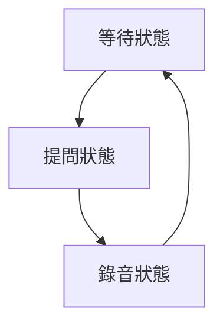

# 有限狀態機框架 FAQ

## 常見問題

### 1. 什麼是有限狀態機？
有限狀態機（Finite State Machine, FSM）是一種計算模型，用於描述系統的行為。

### 2. 狀態機的組成要素
- **狀態（State）**：系統可能處於的各種情況
- **事件（Event）**：觸發狀態轉換的條件
- **轉換（Transition）**：從一個狀態到另一個狀態的過程
- **動作（Action）**：狀態轉換時執行的操作

### 3. 程式碼範例
```java
public class BotState {
    private String name;
    private List<Transition> transitions;
    
    public void addTransition(Transition transition) {
        transitions.add(transition);
    }
}
```

### 4. 狀態圖


## 測試清單
- [x] 標題格式
- [x] 程式碼區塊
- [x] 清單項目
- [ ] 表格格式
- [ ] 連結功能

> **注意**：這是一個測試文件，用於驗證 Markdown All in One 的功能。