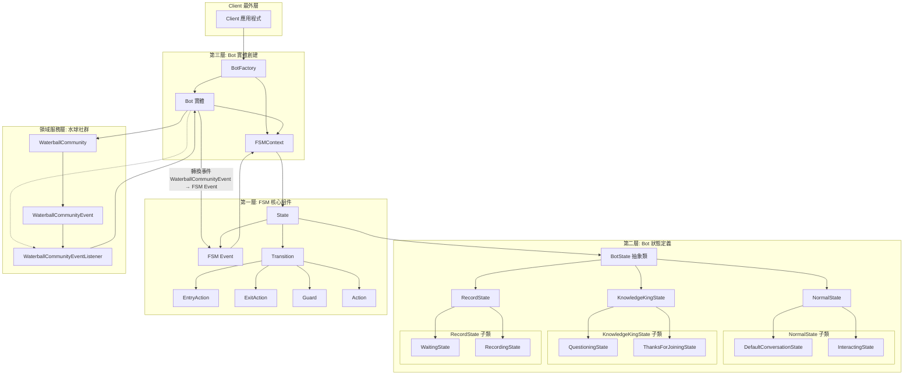

# FSM有限狀態機 心得 & 發問

## 機器人模組分層

### 第一層: 定義 FSM 有限狀態機
- FSMContext
- State
- EntryAction
- ExitAction
- Transition
- Event
- Guard
- Action

### 第二層: 定義 Bot、定義 BotState、以及所有的衍生狀態
- 定義 Bot
  - 每個 Bot 實體都有一個 FSMContext 狀態機
  - Bot 有 "指令配額"、"聆聽並響應水球社群事件" 等概念，也有 "在水球社群發訊息、發貼文、發廣播" 等能力
- 定義 BotEvent (機器人響應的事件)
- 定義 BotState 及其所有衍生類
  - NormalState
    - DefaultConversationState
    - InteractingState
  - KnowledgeKingState
    - QuestioningState
    - ThanksForJoiningState
  - RecordState
    - WaitingState
    - RecordingState

### 第三層: 創建 Bot 實體
- 提供便利的工廠方法介面，創建並組織 Bot 與 FSM狀態機實體
  - 創建 Bot 實體
  - 創建 FSMContext 實體
  - 創建各種 FSMState 實體 (需引入所需的 State 套件)
    - 為每種狀態定義 EntryAction、ExitAction 行為實作
    - 為每種狀態定義 Transition 狀態轉換行為 ([狀態A]遇到[事件]且滿足[條件]就執行[動作]後轉換到[新狀態B])
  - 將所有的狀態，註冊給 FSM 狀態機
  - 指定 FSM狀態機 的 initial state
  - Bot 聆聽水球社群事件

## 水球社群
- 水球社群有定義 WaterballCommunityEventListener 意圖
- 水球社群會發送 WaterballCommunityEvent 給 WaterballCommunityEventListener
- Bot 會實作 WaterballCommunityEventListener，並向水球社群註冊自己為 event listener

## Client
- 操作 Facade 建立 bot 實體，登入水球社群
- 操作 members，在水球社群活動

## 架構圖

